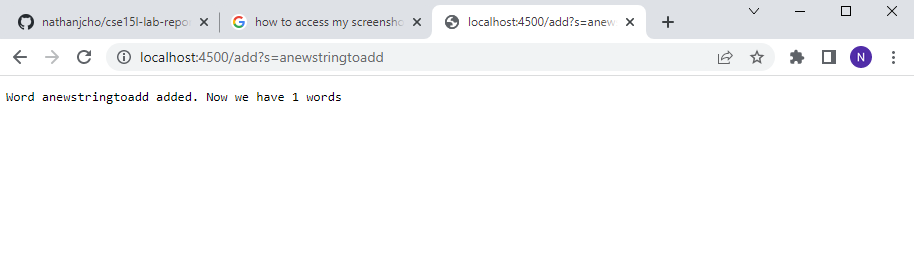
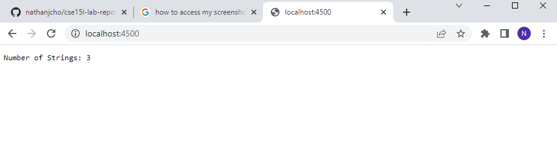
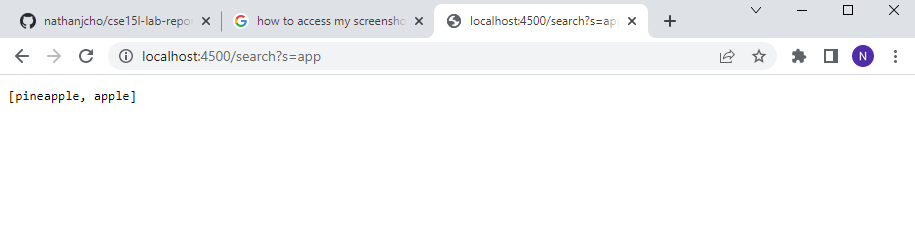
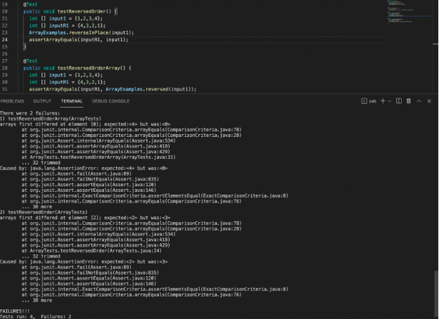
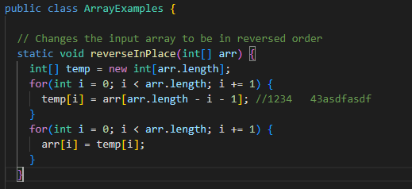
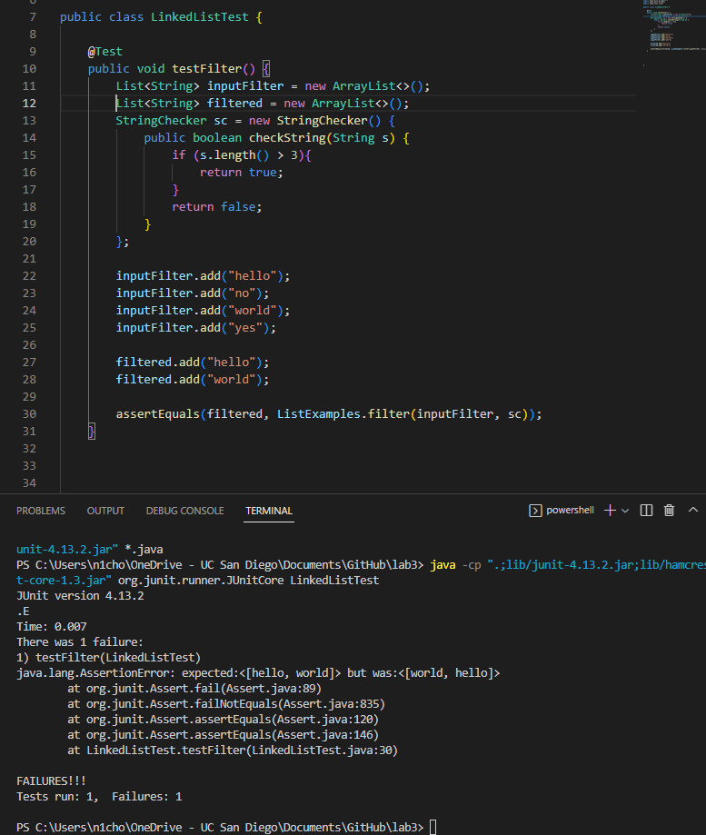
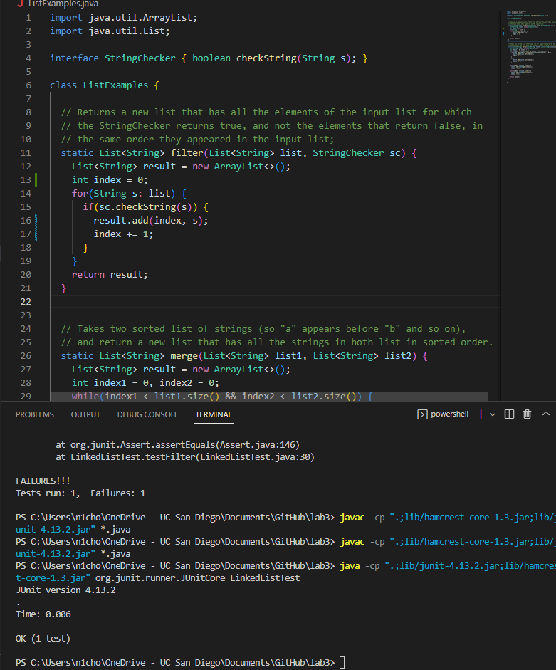

# Lab Report 2

**Part One**

```
import java.io.IOException;
import java.net.URI;
import java.util.*;

class SearchHandler implements URLHandler {
    // The one bit of state on the server: a number that will be manipulated by
    // various requests.
    ArrayList<String> words = new ArrayList<String>();
    ArrayList<String> selectedWords = new ArrayList<String>();

    int numOfWords = 0;

    public String handleRequest(URI url) {
        System.out.println("Path: " + url.getPath());
        if (url.getPath().equals("/")) {
            return String.format("Number of Strings: %d", numOfWords);
        } 
        else if (url.getPath().contains("/add")) { 
            String[] parameters = url.getQuery().split("=");
                if (parameters[0].equals("s")) {
                    String newWord = parameters[1];
                    words.add((newWord));
                    numOfWords += 1;
                    return String.format("Word %s added. Now we have %d words", newWord, numOfWords);
                }
            return String.format("Error. Type in a correct format");
        } 
        else if (url.getPath().contains("/search")) {
            System.out.println("Path: " + url.getPath());
            String[] parameters = url.getQuery().split("=");
                if (parameters[0].equals("s")) {
                    String searchedWord = parameters[1];
                    for (String s : words){
                        if (s.contains(searchedWord)){
                           selectedWords.add(s);
                        }
                    }
                    if (selectedWords.size() == 0) {
                        return String.format("There are no words in the list that contain %s", searchedWord);
                    }
                    else {
                        return selectedWords.toString();
                    }
                }
            return ("Words found");
        } 
        else {
            System.out.println("Path: " + url.getPath());
            return "404 Not Found";
        } 
    }
}

class SearchEngine {
    public static void main(String[] args) throws IOException {
        if(args.length == 0){
            System.out.println("Missing port number! Try any number between 1024 to 49151");
            return;
        }

        int port = Integer.parseInt(args[0]);

        Server.start(port, new SearchHandler());
    }
}
```
---


* This screenshot demonstrates the add method which adds the string to the ArrayList of strings. 
* One relevant argument in the method is the int index value which holds the number of words that are contained in the list. 
* We set String newWord to the word that is expected to be added known as parameter[1] and we add newWord to our ArrayList words. 
* The value of the int index value will change with every word added to the list as it is part of our add if statement. 

---


* This screenshot demonstrates the equalsDash method which when a single dash is inputted after our url, will display the number of strings in our array. 
* The relevant argument in the methodis the int index value which holds the number of words that are contained in the list. 
* The value of the int index value will change with every word added to the list as it is part of our add if statement. 

---


* This screenshot demonstrates the search method which will search for strings in our ArrayList that contain the string inputted and will list the strings that contain that string. 
* The values of the relevant arguments and fields include the two ArrayLists words and selectedWords. In our for loop, the method will look through each string in our words list to see if it contains the inputted string. If it does contain the input, the string is added to the selectedWords ArrayList. 
* If the selectedWords ArrayList contains no words, a statement will appear saying that there are no words that contain the input. However, if selectedWords has a size greater than 0, it will output the words that contain the input. 
* The size of selectedWords will change with iterations of the for loop as the method will add or skip strings that contain the input to the ArrayList, thus affecting its size. 

---

**Part Two**

```
static void reverseInPlace(int[] arr) {
    for(int i = 0; i < arr.length; i += 1) {
      arr[i] = arr[arr.length - i - 1];
    }
  }
```

* The failure-inducing input is any input that has a size greater than 1. When reversing the numbers, the array will only be able to properly reverse the first half of the array and will not be able to properly reverse the second half as the array will overwrite the values when reversing. As such, when the second half of the reversed array looks at the first half of the array, it will have the wrong inputs. 
* For example, the input 1,2,3,4 will lead to the output 4,3,3,4 even though the expected output is 4,3,2,1. 



* By creating a temporary array and storing the reversed inputs in there, we can avoid overwriting the original inputs and thus creating an error of mirroring. 

```
static List<String> filter(List<String> list, StringChecker sc) {
    List<String> result = new ArrayList<>();
    for(String s: list) {
      if(sc.checkString(s)) {
        result.add(0, s);
      }
    }
    return result;
  }
```
* The failure inducing input is when we have inputs that filters out outputs with a size larger than 1. This is because our method to add the filtered outputs to the filtered list only adds the outputs to the very first index. This is because our add method is (0, s). 
* For example, the input "hello", "no", "world", "yes" will result in the output "world", "hello" instead of the expected "hello", "world". 

* This can be solved by creating an index that increases when we find a new filtered output making it so that the output will be added at the end of the list instead of at the front. 





