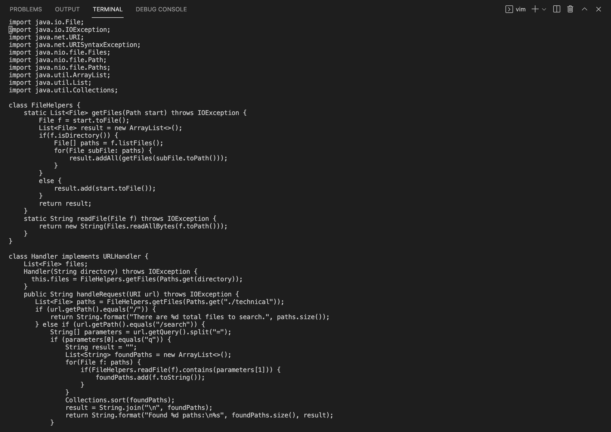
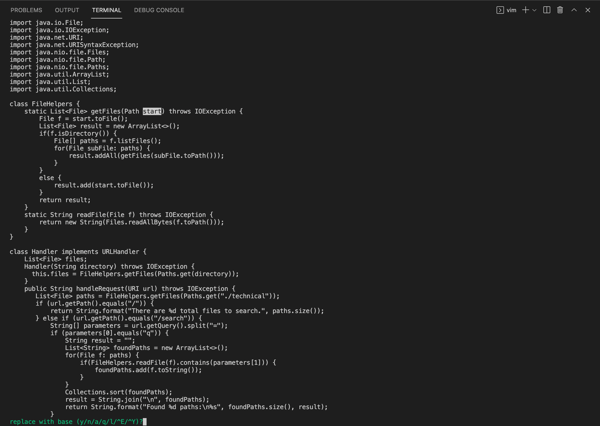
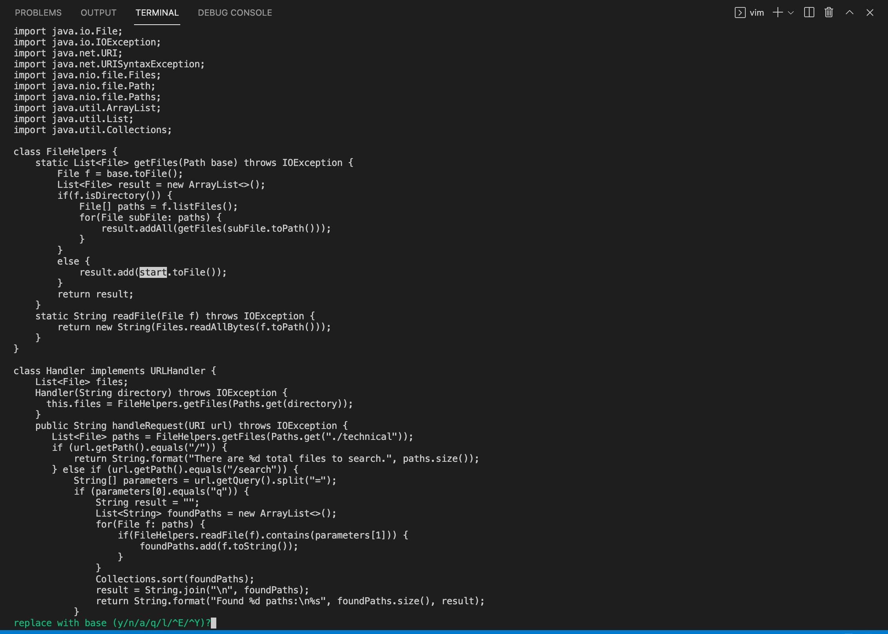
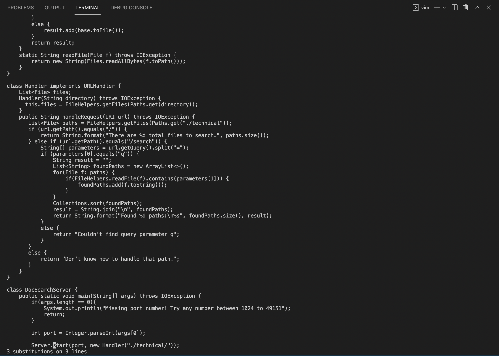

# Lab Report 4

**Part One**

---

* The task that I chose to do from the week 6 lab in less than 30 inputs is "In DocSearchServer.java, change the name of the start parameter of getFiles, and all of its uses, to instead be called base." 
* To start I git cloned the repository git clone https://github.com/ucsd-cse15l-f22/skill-demo1 week6-skill-demo1 and changed my directory into week6-skill-demo1. 
* Then in the terminal I typed in vim DocSearchServer.java which brought up file in my terminal as shown below. 

* The first command I put in vim was `:%s/start/base/gc` which searches for every instance of start and replaces every instance of start to base. I then pressed `<enter>` to execute the command which brought me here. 

* I then pressed `y` which successfully found the first instance of start and replaced it with base. It then found the second instance of start. 

* I pressed `y` `y` more times afterwards, replaced the second and third instances of start with base. IT then found the last instance of start. 

