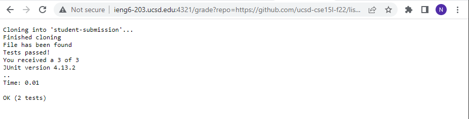
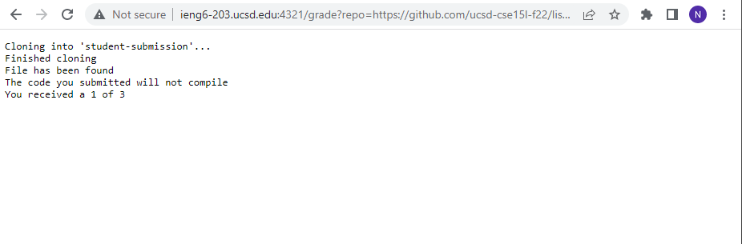
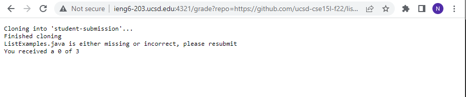

# Lab Report 5


* Code for grade.sh below

```
# Create your grading script here

rm -rf student-submission
git clone $1 student-submission
echo 'Finished cloning'

cd student-submission/

if ! [ -f "ListExamples.java" ] 
then 
    echo "ListExamples.java is either missing or incorrect, please resubmit"
    echo "You received a 0 of 3"
    exit 
fi 

echo "File has been found"
cd ..
cp TestListExamples.java student-submission/
cd student-submission/

javac -cp .:../lib/hamcrest-core-1.3.jar:../lib/junit-4.13.2.jar *.java 2> compile.txt

if [[ $? -ne 0 ]]
then
        echo "The code you submitted will not compile"
        echo "You received a 1 of 3"
        exit 
fi

java -cp .:../lib/hamcrest-core-1.3.jar:../lib/junit-4.13.2.jar org.junit.runner.JUnitCore TestListExamples &> results.txt 

if [ $? -eq 0 ]
then
    echo "Tests passed!"
    echo "You received a 3 of 3"
    cat results.txt
    exit
else
    echo "Not all tests passed"
    echo "You received a 2 of 3"
    cat results.txt
fi
```

* Screenshots of three different student submissions an dtheir reported grade as loaded in the browser 





---

* Example # 3 
* Repository: https://github.com/ucsd-cse15l-f22/list-methods-filename

* Trace: 
* Line 3: stdout = "" ; stderr = "" ; exit code = 0
* Line 5: stdout = "" ; stderr = "Cloning into 'student submission'..." ; exit code = 0
* Line 7: stdout = "Finished cloning" ; stderr = "" ; exit code = 0
* Line 12: The if statement's condition is true since the repository name does not match "ListExampes.java"
* Line 14: stdout = "ListExamples.java is either missing or incorrect, please resubmit" ; stderr = "" ; exit code = 0
* Line 16: stdout = "You received a 0 of 3" ; stderr = "" ; exit code = 0
* Line 19-25: Does not run due to early exit. 
* Line 27: The if statement's condition is false as the repository name does not match "ListExampes.java and thus will not be able to compile properly. 
* Line 28-32: Does not run due to non-evaluated if branch
* Line 34: Does not run due to early exit. 
* Line 36: The if statement's condition is false as the repository name does not match "ListExampes.java and thus will not be able to compare the exit code.
* Line 37-46: Does not run due to non-evaluated if branch