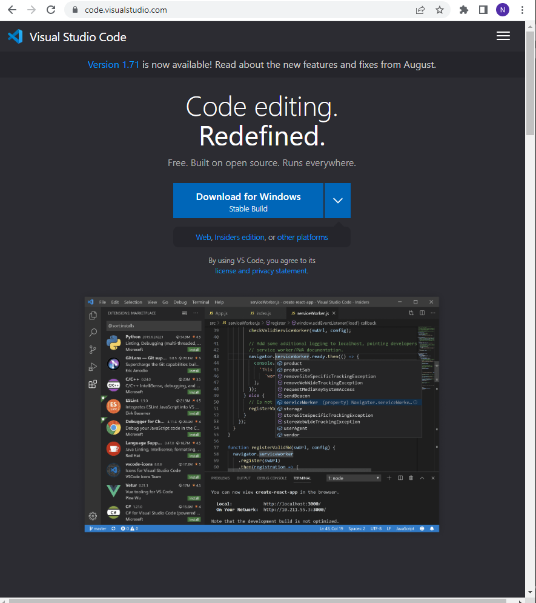
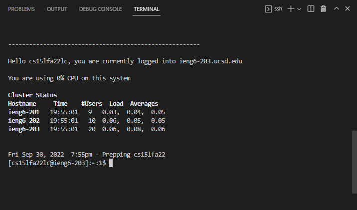
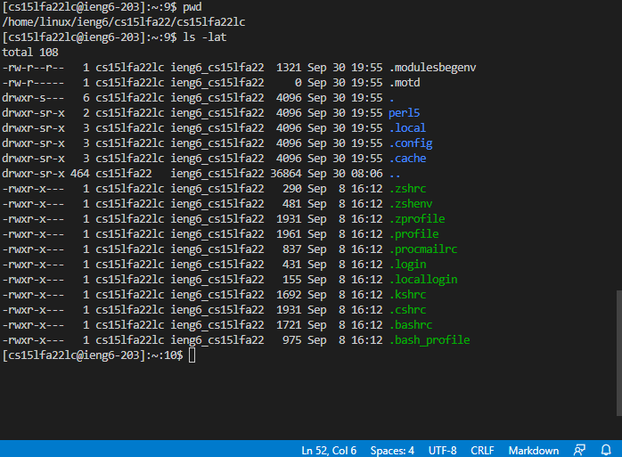
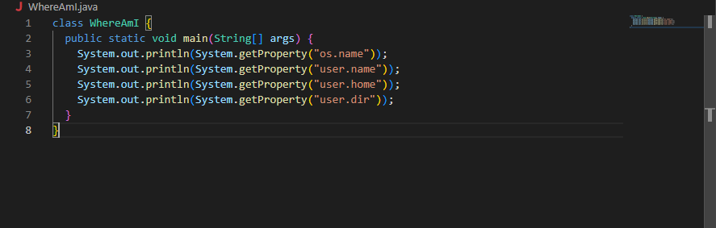
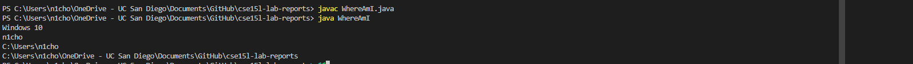
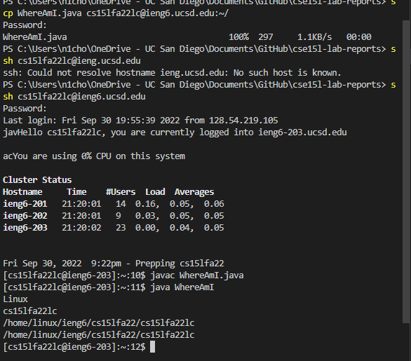
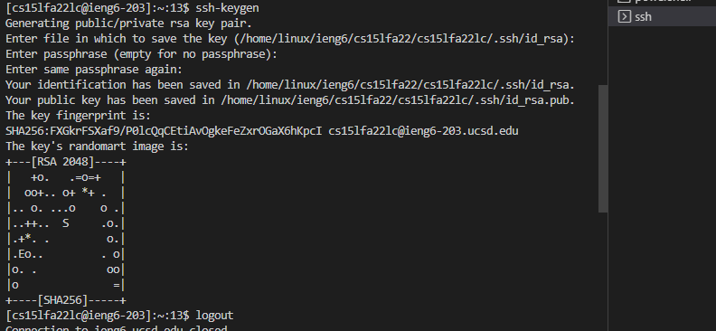
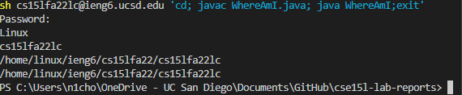

# Week 1 Lab Report

In this tutorial you will learn how to: 

1. Install VS Code
2. Remotely Connect
3. Try New Commands
4. Move Files With scp
5. Set an ssh Key
6. Optimize Remote Running

---

**Step One: Installing VS Code**

* Click on [this link](https://code.visualstudio.com/) to install VS Code if you haven't already

* It should lead you to this page (This link and image is for Windows)



* Download VS Code and follow the installer steps as well as the tutorial 

---

**Step Two: Remotely Connecting**

* Go to terminal in VS Code and open a new terminal 
* Then type in your course-specific account to remotely connect. If you have not already, reset your course account password [here](https://sdacs.ucsd.edu/~icc/index.php) before proceeding. 
* This link should tell you your specific username in cs15lfa22XX where the XX is specific to you. 
Once you have reset your password, type in this command in the terminal and replace the XX with your specific username.

```
$ ssh cs15lfa22XX@ieng6.ucsd.edu
```
* Select (Yes) and enter your password 

* If you have successfully logged in, your terminal should look something like this. 



---

**Step 3: Trying Some Commands**

* There are several commands that you can run once successfully remotely connected either on your computer or the remote one. These include: 

1. cd
2. ls
3. pwd
4. mkdir
5. cp

* This is an example of some commands being run in the terminal



---

**Step Four: Moving Files with scp**

* The scp command allows us to copy and move files from our home computer as well as the computer that we are remotely logged into. However, we wil always run the scp commmand from the home computer. 

* For now, log out of your remote computer by pressing Ctrl + D. 

* Create a new file on your computer and follow the code listed below. 



* Once you've done this, open a new terminal and type in the following commands into your terminal. 



* Run this scp command and enter your password

<<<<<<< HEAD

=======
```
scp WhereAmI.java cs15lfa22XX@ieng6.ucsd.edu:~/

```

* Afterwards, log back into your remote computer using the ssh command and then use the javac and java commands from earlier. If done correctly, it should look similar to this. 



---

**Step Five: Setting an SSH Key**

* Instead of always having to type in our password when we need to log into our remote computer using ssh or scp, we can set up an ssh key. 

* An ssh key program will create a public key whihc is copied to our remote server and the private key will be copied to our local computer. 

* Follow these commands



```
mkdir .ssh
```

* With an ssh key, you should be able to log in quicker than typing in your password. 

---

**Step Six: Optimzing Remote Running**

* There are multiple ways to optimize remote running. These include: 

1. Typing a command in quotes at the end of an ssh command to direclty run it on the remote server then exit right after. 
2. Using semicolons to run multiple commands at once 
3. Using the up-arrow to recall the latest commands to avaoid typing out the whole command again



* We were able to run four commands in a singular line, optimizing the amount of time and effort we need to put in, in order to achieve the same result.  
>>>>>>> 4d1a0afe1291ba84acfd0c72947d67489885895f
